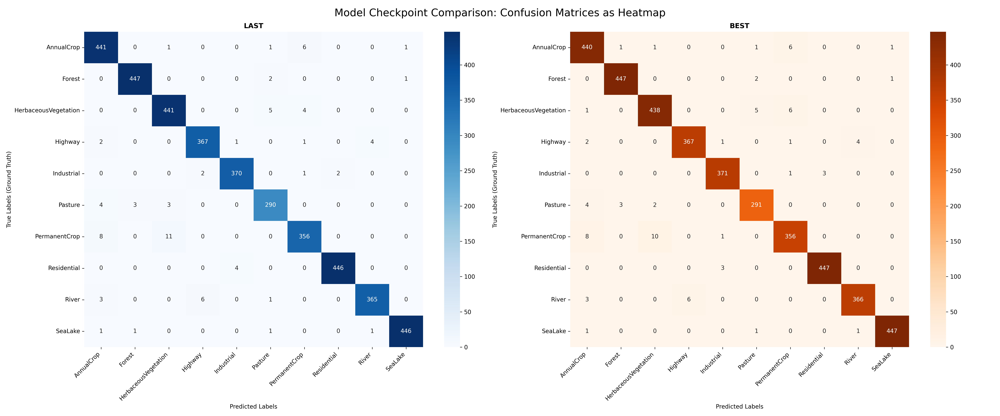
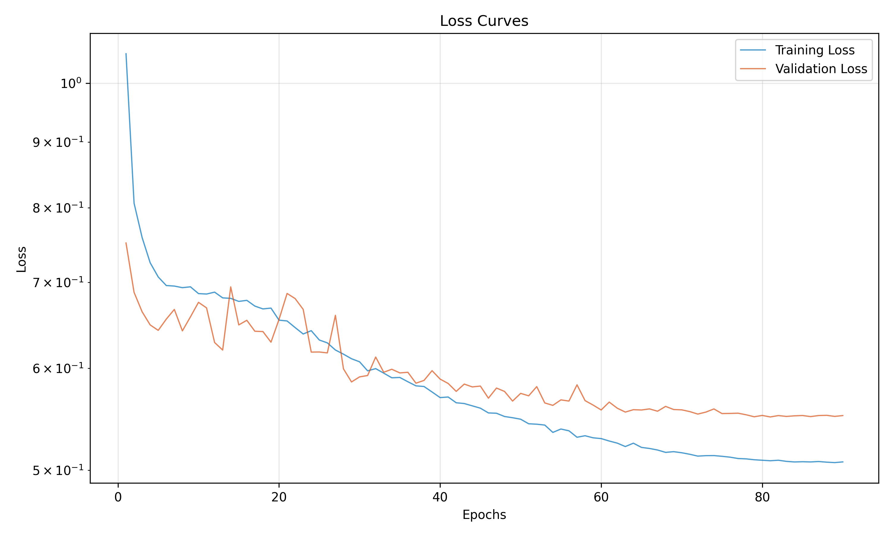
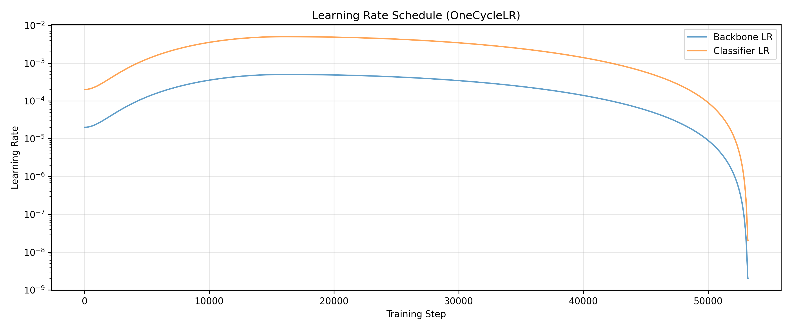

# Satellite Image Classification

This repo implements ResNet classification training on Sentinel-2 satellite image data using a selection of key techniques from the recent literature in the context of analyzing land cover analysis. Image data is available through the EuroSAT dataset.

The smallest available ResNet model, i.e. ResNet18, is able to reach an average precision of ~98%. This result closely approaches the performance of the significantly larger ResNet50 model cited in the original EuroSAT paper (98.57%) while using ~3x fewer parameters.


## Results

**Accuracy on Test Set Split: ~98%**

### Confusion Matrices



### Training Curves





---

**Classification Report**: Best Model Checkpoint (Scikit-Learn)

|                      | precision | recall | f1-score | support |
|----------------------|-----------|--------|----------|---------|
| **accuracy**         | -         | -      | **0.9802** | 4050    |
| **macro avg**        | 0.9799    | 0.9794 | 0.9797   | 4050    |
| **weighted avg**     | **0.9803**| 0.9802 | 0.9802   | 4050    |

## Technical Approach

**Architecture**
- Base Model: ResNet18 (Trained on 224x224 ImageNet images)
- Training on 64x64 EuroSAT images
- Spatial resolution preservation attempt by using 3x3 kernel with stride 1
- Low resolution input: Removed initial MaxPool layer

**Technique Selection**
- **Discriminative Finetuning**: Different respective learning rates for backbone (generic features) and classifier (new task) 
- **Learning Rate Scheduling**: OneCycleLR (Eliminates manual learning rate tuning)
- **Mixed Precision Training**: Training speedup at negligible performance degradation
- **Label Smoothing**: Regularization

**Augmentation**
- Standard transformations approximating expected data variation in satellite imagery, i.e. flip and rotation
- Capturing lighting scenarios due to atmospheric effects via ColorJitter
- **Atmospheric Haze**: Modeling of blueish color tint augmentation (No atmospheric correction according to EuroSAT publication)

## Repo tree

```
.                      
├── data/
│   └── samples/eurosat/               # Sample images (one per class)
├── notebooks/
│   ├── data_processing.ipynb          # Pre-Processing: Data preparation
│   └── train_eval.ipynb               # Main: Complete training loop, data processing and evaluation
├── results/
│   └── figures/
├── references/
│   ├── eurosat_helber_etal.pdf        # EuroSAT paper
│   ├── sentinel-2-drusch-etal.pdf     # Sentinel-2 mission specifications
│   ├── general/                       # General
│   ├── specific/                      # Implementation-specific
│   └── misc/                          # Background
├── .gitignore
└── README.md 
```

## Quick Start

```bash
# Verifiy GPU driver and CUDA (WSL)
nvidia-smi
nvcc --version  # e.g. 11.8 (if newer, modify PyTorch installation command)

# Setup Python virtual environment
python -m venv venv
source venv/bin/activate  # Linux/WSL

# Minimal dependencies with GPU/CUDA availability (Linux / WSL2)
python -m pip install tensorflow[and-cuda] tensorflow-datasets pillow numpy matplotlib seaborn scikit-learn tqdm
python -m pip install ipykernel  # Jupyter kernel support for venv/conda
python -m pip install torch==2.7.1 torchvision==0.22.1 torchaudio==2.7.1 --index-url https://download.pytorch.org/whl/cu118
python -m pip install torchinfo torchviz  # Model visualization libraries

# Verify GPU setup
python -c "import tensorflow as tf; print(tf.config.list_physical_devices('GPU'))"

# Register venv as Jupyter kernel
python -m ipykernel install --user --name=venv --display-name="NAME"

# if relevant: initialize your (general) general conda working environment
conda activate my_conda_env
```

## References

Relevant publications are collected in the `./references` directory.

### Data

- [EuroSAT GitHub Repository](https://github.com/phelber/EuroSAT)

- **Helber, P., Bischke, B., Dengel, A., & Borth, D. (2019).** EuroSAT: A Novel Dataset and Deep Learning Benchmark for Land Use and Land Cover Classification. *IEEE Journal of Selected Topics in Applied Earth Observations and Remote Sensing*, 12(7), 2217-2226.
- **Drusch, M., et al. (2012).** Sentinel-2: ESA's Optical High-Resolution Mission for GMES Operational Services. *Remote Sensing of Environment*, 120, 25-36.

### Techniques

See `./references` directory.