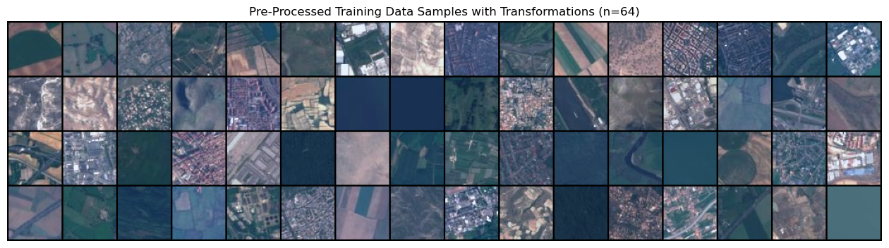
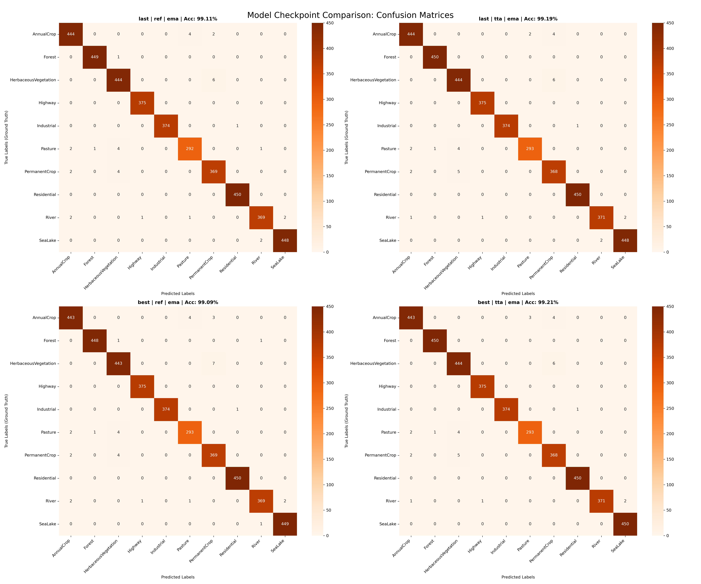
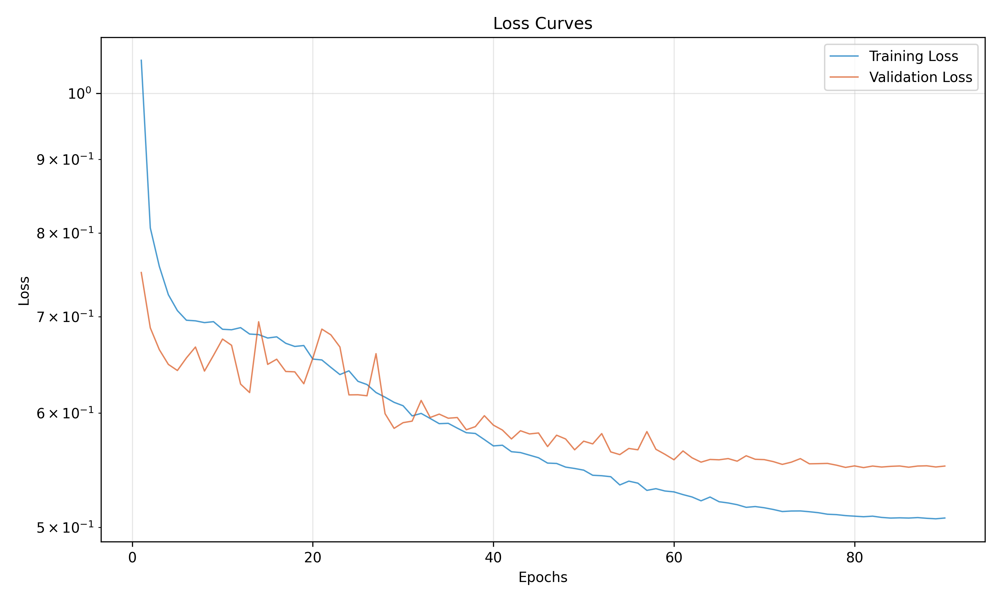

# Satellite Image Classification



Implementation of modified ResNet model classification task training on Sentinel-2 satellite images using a selection of key techniques from the recent literature.  

Improved classifiaction performance is relevant in the context of land cover analysis. The employed training data is openly available as the EuroSAT dataset.

The smallest available ResNet model, i.e. ResNet18, is able to reach an average precision of ~98%. This result closely approaches the performance of the significantly larger ResNet50 model variant cited in the original publication while using ~3x fewer parameters.

## Results

Final ResNet18 accuracy on *test* split: **0.9803**

Reported ResNet50 accuracy: **0.9857** (Helber etal, 2019)

### Confusion Matrices



### Training Curves



|                      | precision | recall | f1-score | support |
|----------------------|-----------|--------|----------|---------|
| **accuracy**         | -         | -      | **0.9802** | 4050    |
| **macro avg**        | 0.9799    | 0.9794 | 0.9797   | 4050    |
| **weighted avg**     | **0.9803**| 0.9802 | 0.9802   | 4050    |

**Table**: *Classification Report* (best model checkpoint)

---

## Technical Approach

**Architecture**
- Base Model: ResNet18 (Trained on 224x224 ImageNet images)
- Training Data: 64x64 EuroSAT images
- Low resolution input: Initial MaxPool layer removed
- Spatial resolution preservation: 3x3 kernel (Stride 1)

**Training Technique Selection**
- *Discriminative Finetuning*: Different learning rates for:
    - Backbone: Generic features known &rarr; Lower LR
    - Classifier: Learns new task &rarr; Higher LR
- *Learning Rate Scheduling*: OneCycleLR &rarr; Eliminates manual tuning
- *Mixed Precision Training*: Better performance (operation specific dtypes)
- *Label Smoothing*: Regularization

**Augmentation Approach**
- Approximation of variation in satellite image data &rarr; Spatial transformations
- Capturing lighting variaton induced by atmospheric effects &rarr; Color jitter
- *Atmospheric Haze*: Augemntation modeling of blueish color tint observation &rarr; Present due to missing atmospheric correction (cf. EuroSAT paper)

## Directory tree

```
.                      
├── data/
│   └── samples/eurosat/               # Sample images (one per class)
├── notebooks/
│   ├── data_processing.ipynb          # Pre-Processing: Data preparation
│   └── train_eval.ipynb               # Main: Complete training loop, data processing and evaluation
├── results/
│   └── figures/
├── references/
│   ├── eurosat_helber_etal.pdf        # EuroSAT paper
│   ├── sentinel-2-drusch-etal.pdf     # Sentinel-2 mission specifications
│   ├── general/                       # General
│   ├── specific/                      # Implementation-specific
│   └── misc/                          # Background
├── .gitignore
└── README.md 
```

## Quick Start

```bash
# Clone repository
git clone https://github.com/jntnlx/satellite-image-classification.git
cd satellite-image-classification

# Verify GPU driver version (i.e. supports CUDA 12.4+)
nvidia-smi

# Virtual env setup via Conda/Mamba (isolated CUDA 12.4 runtime)
mamba clean --all -y  # Optional package cache clean-up
mamba env create --channel-priority flexible -f environment.yml
mamba activate eurosat-resnet  # Activate

# Install remaining diagnostic/visualization packages
python -m pip install -r requirements.txt

# Verify GPU setup is working
python -c "import torch; print(f'CUDA available: {torch.cuda.is_available()} ({torch.cuda.get_device_name(0) if torch.cuda.is_available() else \"No GPU\"})')"

# Register Jupyter kernel
python -m ipykernel install --user --name eurosat-resnet --display-name "eurosat-resnet"
```

## References

Relevant publications are collected in the `./references` directory.

### Satellite Data Source

- [EuroSAT GitHub Repository](https://github.com/phelber/EuroSAT)

- **Helber, P., Bischke, B., Dengel, A., & Borth, D. (2019).** EuroSAT: A Novel Dataset and Deep Learning Benchmark for Land Use and Land Cover Classification. *IEEE Journal of Selected Topics in Applied Earth Observations and Remote Sensing*, 12(7), 2217-2226.
- **Drusch, M., et al. (2012).** Sentinel-2: ESA's Optical High-Resolution Mission for GMES Operational Services. *Remote Sensing of Environment*, 120, 25-36.

### Techniques

For more details see `./references` directory.