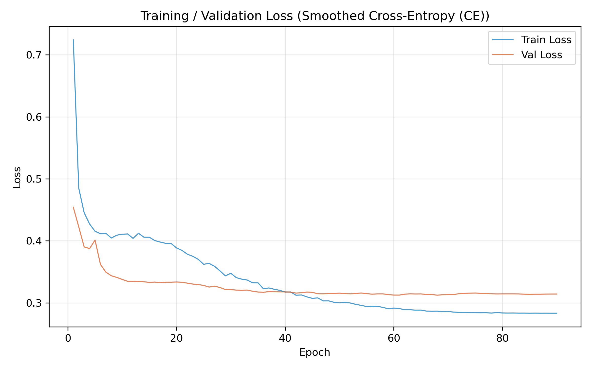

# Satellite Image Classification


Implementation of modified ResNet model for Sentinel-2 satellite image classification using a selection of key techniques from the recent literature.

Improved classifiaction performance is relevant in the context of land cover analysis. The employed training data is openly available as the "EuroSAT RGB" dataset.

After implementing all planned techniques and an extended training run on local hardware, the smallest available ResNet model, i.e. ResNet18, reaches a precision of **99.21%** (weighted avg). Notably, this exceeds the **98.57%** accuracy reported for the significantly larger ResNet50 model in the original EuroSAT publication while using approximately three times fewer parameters.

## Results

Final ResNet18 accuracy on *test* split: **0.9921**

Reported ResNet50 accuracy: **0.9857** (Helber etal, 2019)

Note: Reported result corresponds to "best" EMA checkpoint (selected via validation) with D4 augmentation @ test time.

### Confusion Matrices


### Training Curves



|                      | precision | recall | f1-score | support |
|----------------------|-----------|--------|----------|---------|
| **accuracy**         | -         | -      | **0.9921** | 4050    |
| **macro avg**        | 0.9921    | 0.9916 | 0.9918   | 4050    |
| **weighted avg**     | **0.9921**| 0.9921 | 0.9921   | 4050    |

**Table**: *Classification Report* ("best" EMA checkpoint with D4 aug.)

---

## Technical Approach

**Architecture**
- Base Model: ResNet18 (trained on 224x224 ImageNet images)
- Training Data: 64x64 EuroSAT RGB images (JPEG format)
- Low resolution input: Initial MaxPool layer removed
- Spatial resolution preservation: 3x3 input kernel (stride 1) with randomly initialized weights 

**Training Technique Selection**
- *Discriminative Finetuning*: Different learning rates for:
    - Backbone: Generic features known &rarr; Lower LR
    - Classifier: Learns new task &rarr; Higher LR
- *Optimizer*: AdamW (decoupled weight decay)
- *Learning Rate Scheduling*: OneCycleLR (cosine annealing)
- *Mixed Precision Training*: Better performance (operation specific dtypes)
- *Label Smoothing*: Regularization
- *Exponential Moving Average*: Averaging of weight and BatchNorm buffer for stable inference
- *Model Selection*: Via validation accuracy (hard cross-entropy as criterion for ties)
- *Test Time Augmentation (TTA)*: D4 rotations and horizontal flips (averaged logits)

**Augmentation Approach**
- Approximation of orientation variation in satellite image data &rarr; Rotations and horizontal flips
- Capturing lighting variaton induced by atmospheric effects &rarr; Color jitter
- *Atmospheric Haze*: Augemntation modeling of blueish color tint observation &rarr; Present due to missing atmospheric correction (cf. EuroSAT paper)

## Directory tree

```
.                      
├── data/
│   ├── raw/eurosat/                   # Downloaded EuroSAT (RGB) dataset
│   ├── processed/eurosat/             # Train/Val/Test split
│   └── samples/eurosat/               # Sample images (one per class)
├── notebooks/
│   ├── data.ipynb                     # Dataset download/extraction and diagnostics
│   └── train_eval.ipynb               # Training and evaluation pipeline
├── results/
│   └── figures/
├── references/
│   ├── eurosat_helber_etal.pdf        # EuroSAT paper
│   ├── sentinel-2-drusch-etal.pdf     # Sentinel-2 mission specifications
│   ├── general/
│   ├── specific/                      # Implementation
│   └── misc/                          # Background
├── src/
│   ├── __init__.py
│   ├── models.py
│   └── utils.py
├── environment.yml
├── requirements.txt
└── README.md 
```

## Quick Start

```bash
# Clone repository
git clone https://github.com/jntnlx/satellite-image-classification.git
cd satellite-image-classification

# Verify GPU driver version (i.e. supports CUDA 12.4+)
nvidia-smi

# Virtual env setup via Conda/Mamba (isolated CUDA 12.4 runtime)
mamba clean --all -y  # Optional package cache clean-up
mamba env create --channel-priority flexible -f environment.yml
mamba activate eurosat-resnet  # Activate

# Install remaining diagnostic/visualization packages
python -m pip install -r requirements.txt

# Verify GPU setup is working
python -c "import torch; print(f'CUDA available: {torch.cuda.is_available()} ({torch.cuda.get_device_name(0) if torch.cuda.is_available() else \"No GPU\"})')"

# Register Jupyter kernel
python -m ipykernel install --user --name eurosat-resnet --display-name "eurosat-resnet"
```

## References

Relevant reference publications are collected in the `./references` directory.

### Satellite Data Source

- [EuroSAT GitHub Repository](https://github.com/phelber/EuroSAT)

- **Helber, P., Bischke, B., Dengel, A., & Borth, D. (2019).** EuroSAT: A Novel Dataset and Deep Learning Benchmark for Land Use and Land Cover Classification. *IEEE Journal of Selected Topics in Applied Earth Observations and Remote Sensing*, 12(7), 2217-2226.
- **Drusch, M., et al. (2012).** Sentinel-2: ESA's Optical High-Resolution Mission for GMES Operational Services. *Remote Sensing of Environment*, 120, 25-36.